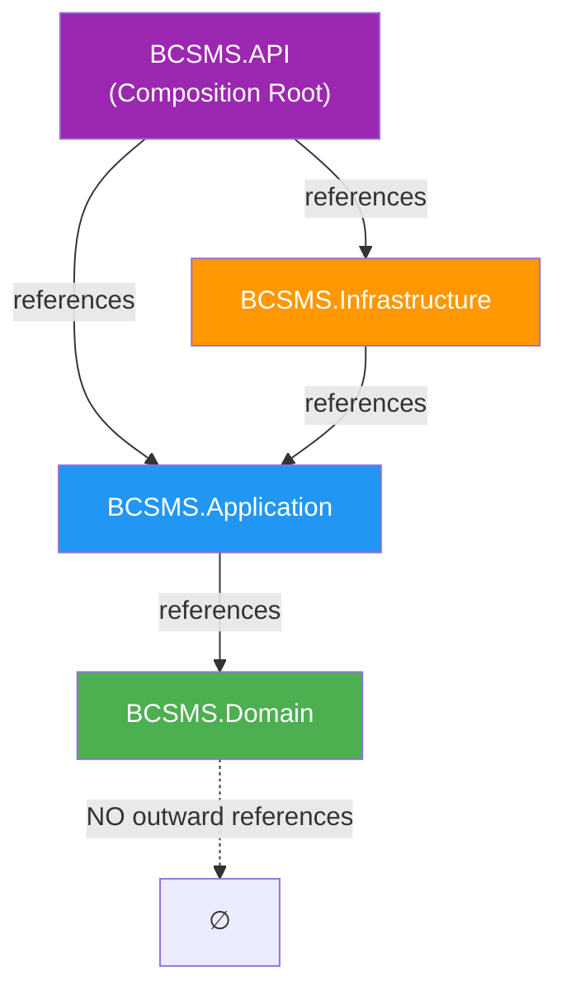

# BCSMS — Structural Architecture Review

**Date:** 2026-08-19
**Solution:** [`BCSMS.sln`](file:///Users/mervebilgin/BursaCityServiceManagement/backend/dotnet/BCSMS.sln)
**Scope:** Read-only review — no files were modified.

---

## 1. Project-to-Project References

| Project | Project References | NuGet Packages |
|---------|-------------------|----------------|
| [`BCSMS.Domain`](file:///Users/mervebilgin/BursaCityServiceManagement/backend/dotnet/src/BCSMS.Domain/BCSMS.Domain.csproj) | **None** | **None** |
| [`BCSMS.Application`](file:///Users/mervebilgin/BursaCityServiceManagement/backend/dotnet/src/BCSMS.Application/BCSMS.Application.csproj) | `BCSMS.Domain` | `Microsoft.Extensions.DependencyInjection.Abstractions 8.0.2` |
| [`BCSMS.Infrastructure`](file:///Users/mervebilgin/BursaCityServiceManagement/backend/dotnet/src/BCSMS.Infrastructure/BCSMS.Infrastructure.csproj) | `BCSMS.Application` | `Microsoft.Extensions.DependencyInjection.Abstractions 8.0.2` |
| [`BCSMS.API`](file:///Users/mervebilgin/BursaCityServiceManagement/backend/dotnet/src/BCSMS.API/BCSMS.API.csproj) | `BCSMS.Application`, `BCSMS.Infrastructure` | `Swashbuckle.AspNetCore 6.4.0` |
| [`BCSMS.UnitTests`](file:///Users/mervebilgin/BursaCityServiceManagement/backend/dotnet/tests/BCSMS.UnitTests/BCSMS.UnitTests.csproj) | `BCSMS.Application`, `BCSMS.Domain` | `xunit 2.9.0`, `xunit.runner.visualstudio 2.8.2`, `Microsoft.NET.Test.Sdk 17.8.0` |
| [`BCSMS.IntegrationTests`](file:///Users/mervebilgin/BursaCityServiceManagement/backend/dotnet/tests/BCSMS.IntegrationTests/BCSMS.IntegrationTests.csproj) | `BCSMS.API`, `BCSMS.Infrastructure` | `xunit 2.9.0`, `xunit.runner.visualstudio 2.8.2`, `Microsoft.NET.Test.Sdk 17.8.0`, `Microsoft.AspNetCore.Mvc.Testing 8.0.8` |

---

## 2. Dependency Direction — Clean Architecture Compliance



| Rule | Expected | Actual | Status |
|------|----------|--------|--------|
| Domain → nothing | No references | No references | ✅ Pass |
| Application → Domain only | Domain | Domain | ✅ Pass |
| Infrastructure → Application only | Application | Application | ✅ Pass |
| API → Application + Infrastructure | Application, Infrastructure | Application, Infrastructure | ✅ Pass |
| No reverse dependency (Domain ← any) | Domain has 0 inbound project refs from layers it shouldn't depend on | Confirmed | ✅ Pass |
| No circular references | None | None | ✅ Pass |

> [!NOTE]
> The API project referencing both Application and Infrastructure is correct — it acts as the **Composition Root** responsible for wiring dependency injection. It does not use Infrastructure types for business logic.

**Verdict: ✅ Dependency direction is correct and follows Clean Architecture principles.**

---

## 3. Domain Isolation Audit

Verifying that [`BCSMS.Domain`](file:///Users/mervebilgin/BursaCityServiceManagement/backend/dotnet/src/BCSMS.Domain/BCSMS.Domain.csproj) has no dependency on frameworks or other layers:

| Dependency Type | Check | Status |
|----------------|-------|--------|
| BCSMS.Application | Not referenced | ✅ Clean |
| BCSMS.Infrastructure | Not referenced | ✅ Clean |
| BCSMS.API | Not referenced | ✅ Clean |
| Entity Framework Core | No `Microsoft.EntityFrameworkCore` package | ✅ Clean |
| ASP.NET Core | SDK is `Microsoft.NET.Sdk` (not `.Web`) | ✅ Clean |
| Any NuGet packages | Zero packages | ✅ Clean |

The Domain project uses:
- SDK: `Microsoft.NET.Sdk` (plain class library — no web or EF dependency)
- Target: `net8.0`
- Contents: Single [`DomainAssemblyMarker.cs`](file:///Users/mervebilgin/BursaCityServiceManagement/backend/dotnet/src/BCSMS.Domain/Common/DomainAssemblyMarker.cs) placeholder

**Verdict: ✅ Domain is fully isolated. Zero external dependencies.**

---

## 4. NuGet Package Audit

| Package | Project(s) | Justified? | Notes |
|---------|-----------|------------|-------|
| `Microsoft.Extensions.DependencyInjection.Abstractions 8.0.2` | Application, Infrastructure | ✅ Yes | Required for `IServiceCollection` extension methods in `DependencyInjection.cs` |
| `Swashbuckle.AspNetCore 6.4.0` | API | ✅ Yes | Standard Swagger/OpenAPI support for development |
| `xunit 2.9.0` | UnitTests, IntegrationTests | ✅ Yes | Test framework |
| `xunit.runner.visualstudio 2.8.2` | UnitTests, IntegrationTests | ✅ Yes | Test runner adapter |
| `Microsoft.NET.Test.Sdk 17.8.0` | UnitTests, IntegrationTests | ✅ Yes | Required for `dotnet test` |
| `Microsoft.AspNetCore.Mvc.Testing 8.0.8` | IntegrationTests | ✅ Yes | `WebApplicationFactory` for integration testing |

**Verdict: ✅ No unnecessary NuGet packages detected. All packages are justified and minimal.**

---

## 5. .gitignore Coverage

Reviewing [`/.gitignore`](file:///Users/mervebilgin/BursaCityServiceManagement/.gitignore):

| Category | Patterns Present | Status |
|----------|-----------------|--------|
| `bin/` directories | `[Bb]in/` | ✅ Covered |
| `obj/` directories | `[Oo]bj/` | ✅ Covered |
| Visual Studio files | `.vs/`, `*.suo`, `*.user`, `*.userosscache`, `*.sln.docstates` | ✅ Covered |
| Rider files | `.idea/` | ✅ Covered |
| VS Code files | `.vscode/` | ✅ Covered |
| NuGet packages | `*.nupkg`, `*.snupkg`, `**/[Pp]ackages/*` | ✅ Covered |
| Secrets / .env files | `.env`, `.env.local`, `.env.*.local` | ✅ Covered |
| Debug/Release builds | `[Dd]ebug/`, `[Rr]elease/` | ✅ Covered |
| macOS artifacts | `.DS_Store` | ✅ Covered |
| Windows artifacts | `Thumbs.db` | ✅ Covered |
| Node.js | `node_modules/`, `dist/`, `build/` | ✅ Covered |
| Java/Gradle | `target/`, `.gradle/`, `build/`, `*.class`, `*.jar` | ✅ Covered |
| Docker override | `docker-compose.override.yml` | ✅ Covered |
| Log files | `[Ll]og/`, `[Ll]ogs/`, `*.log` | ✅ Covered |

> [!TIP]
> One minor observation: `appsettings.*.json` or user-secrets related files like `secrets.json` are **not** excluded. This is currently correct — `appsettings.json` and `appsettings.Development.json` should be tracked. The .NET user-secrets store is kept outside the project directory by default (`~/.microsoft/usersecrets/`), so no gitignore entry is needed for that.

**Verdict: ✅ .gitignore provides comprehensive coverage for all three tech stacks.**

---

## 6. Docker Compose Review

[`docker-compose.yml`](file:///Users/mervebilgin/BursaCityServiceManagement/docker-compose.yml):

```yaml
version: "3.8"
services: {}
```

- Contains only comments listing future planned services (`bcsms-api`, `bcsms-db`, `bcsms-web`)
- `services: {}` is an empty map — no containers will be created
- No volumes, networks, or environment variables defined

**Verdict: ✅ Confirmed placeholder only. No Docker configuration is active.**

---

## 7. Build Results

```
dotnet restore BCSMS.sln   → ✅ Success (all 6 projects restored)
dotnet build BCSMS.sln     → ✅ Success
```

```
Build order:
  1. BCSMS.Domain           → ✅
  2. BCSMS.Application      → ✅
  3. BCSMS.Infrastructure   → ✅
  4. BCSMS.UnitTests        → ✅
  5. BCSMS.API              → ✅
  6. BCSMS.IntegrationTests → ✅
```

## 8. Warnings & Errors

| Type | Count |
|------|-------|
| **Errors** | **0** |
| **Warnings** | **0** |

**Verdict: ✅ Clean build with zero diagnostics.**

---

## 9. Unnecessary Abstractions & Premature Implementation Review

| File | Assessment |
|------|-----------|
| [`Domain/Common/DomainAssemblyMarker.cs`](file:///Users/mervebilgin/BursaCityServiceManagement/backend/dotnet/src/BCSMS.Domain/Common/DomainAssemblyMarker.cs) | ✅ Minimal — empty static class, just enough to make the project compilable |
| [`Application/DependencyInjection.cs`](file:///Users/mervebilgin/BursaCityServiceManagement/backend/dotnet/src/BCSMS.Application/DependencyInjection.cs) | ✅ Minimal — empty `AddApplication()` extension method, no premature registrations |
| [`Infrastructure/DependencyInjection.cs`](file:///Users/mervebilgin/BursaCityServiceManagement/backend/dotnet/src/BCSMS.Infrastructure/DependencyInjection.cs) | ✅ Minimal — empty `AddInfrastructure()` extension method, no premature registrations |
| [`API/Program.cs`](file:///Users/mervebilgin/BursaCityServiceManagement/backend/dotnet/src/BCSMS.API/Program.cs) | ✅ Minimal — standard startup wiring (controllers, Swagger, DI calls), no business logic |
| [`UnitTests/SampleTest.cs`](file:///Users/mervebilgin/BursaCityServiceManagement/backend/dotnet/tests/BCSMS.UnitTests/SampleTest.cs) | ✅ Minimal — single `Assert.True(true)` placeholder |
| [`IntegrationTests/SampleTest.cs`](file:///Users/mervebilgin/BursaCityServiceManagement/backend/dotnet/tests/BCSMS.IntegrationTests/SampleTest.cs) | ✅ Minimal — single `Assert.True(true)` placeholder |

**No premature abstractions found:**
- No repository interfaces defined before entities exist
- No generic base classes created without concrete use cases
- No CQRS/MediatR patterns wired up prematurely
- No middleware or filters registered before they're needed
- No DTOs, mapping profiles, or validation pipelines defined yet

**Verdict: ✅ No unnecessary abstractions or premature implementation detected.**

---

## Summary

| # | Check | Status |
|---|-------|--------|
| 1 | Project references listed | ✅ |
| 2 | Clean Architecture dependency direction | ✅ Correct |
| 3 | Domain isolation (no EF, no ASP.NET, no layer refs) | ✅ Fully isolated |
| 4 | NuGet package audit | ✅ No unnecessary packages |
| 5 | .gitignore coverage | ✅ Comprehensive |
| 6 | docker-compose.yml | ✅ Placeholder only |
| 7 | dotnet restore + dotnet build | ✅ Success |
| 8 | Warnings & errors | ✅ 0 warnings, 0 errors |
| 9 | Premature implementation | ✅ None detected |

> [!IMPORTANT]
> **All 9 checks passed. The solution is structurally sound and ready for the Domain phase.**
