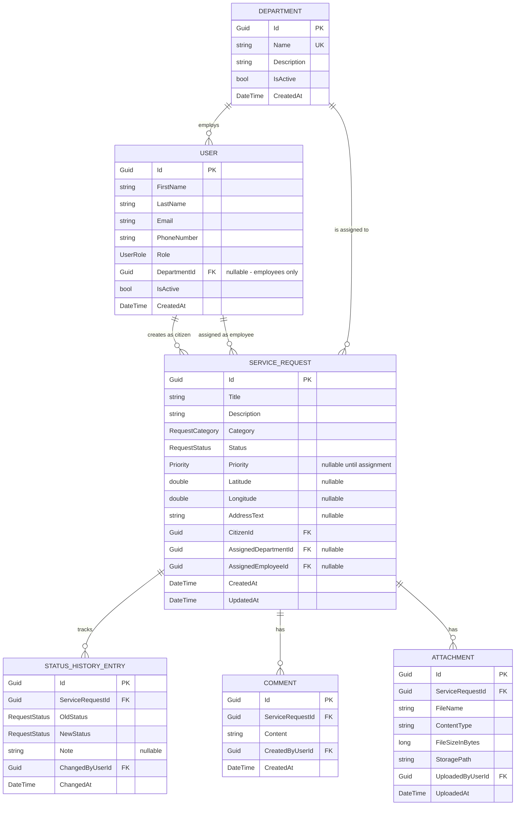
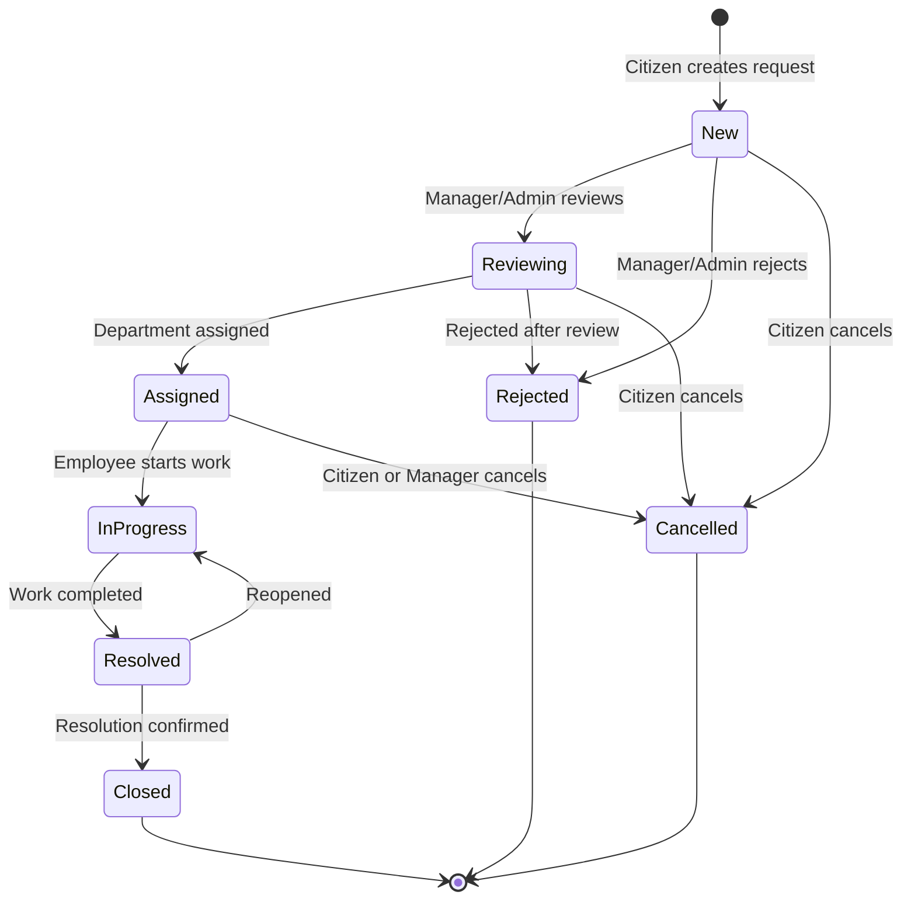

# Phase 2: Domain Analysis & Design — BCSMS

**Date:** 2026-08-19
**Scope:** Analysis only — no code changes.

---

## 1. Core Domain Entities

| Concept | Classification | Rationale |
|---------|---------------|-----------|
| **ServiceRequest** | Entity (Aggregate Root) | Central business object with identity, lifecycle, and rich behavior |
| **User** | Entity (Aggregate Root) | System participant with identity; citizens, employees, managers, admins |
| **Department** | Entity (Aggregate Root) | Organizational unit that owns request resolution |
| **StatusHistoryEntry** | Entity (child of ServiceRequest) | Tracks each status transition with timestamp and actor |
| **Comment** | Entity (child of ServiceRequest) | Notes added by citizens or staff |
| **Attachment** | Entity (child of ServiceRequest) | File metadata only — not the file itself |

These six concepts form the backbone of the domain.

---

## 2. Entity vs Value Object vs Enum vs Infrastructure

### Entities (have identity, mutable lifecycle)

| Name | Scope | Why Entity? |
|------|-------|-------------|
| ServiceRequest | Aggregate root | Central lifecycle object, uniquely identified, mutable state |
| User | Aggregate root | Uniquely identified person in the system |
| Department | Aggregate root | Organizational unit, uniquely identified |
| StatusHistoryEntry | Child of ServiceRequest | Each transition is a distinct record within the request |
| Comment | Child of ServiceRequest | Each comment is distinct and ordered |
| Attachment | Child of ServiceRequest | Each attachment is a distinct file reference |

### Value Objects (no identity, defined by attributes, immutable)

| Name | Belongs To | Why Value Object? |
|------|-----------|-------------------|
| Location | ServiceRequest | A (latitude, longitude, addressText) tuple — two locations with the same coordinates are interchangeable |
| ContactInfo | User | (phone, email) grouping — no independent identity |
| FullName | User | (firstName, lastName) grouping — semantically a single concept |

### Enums

| Name | Values | Why Enum? |
|------|--------|-----------|
| RequestStatus | New, Reviewing, Assigned, InProgress, Resolved, Closed, Rejected, Cancelled | Fixed, finite set of lifecycle states |
| RequestCategory | RoadDamage, WasteCleaning, StreetLighting, ParkGarden, Flooding, NoiseComplaint, SocialAssistance, Other | Fixed municipal service categories |
| Priority | Low, Medium, High, Critical | Fixed priority scale |
| UserRole | Citizen, Employee, Manager, Admin | Fixed set of system roles |

### Infrastructure / Application Concerns (NOT in Domain)

| Concept | Layer | Rationale |
|---------|-------|-----------|
| Audit logging | Infrastructure | Cross-cutting concern; EF interceptor or middleware |
| Notification delivery | Application + Infrastructure | Side effect of domain state changes; delivery is infrastructure |
| File storage | Infrastructure | Physical file handling — Domain only holds metadata |
| Authentication / Authorization | API + Infrastructure | Framework-specific (JWT, ASP.NET Identity) |
| Email / SMS sending | Infrastructure | External service integration |

---

## 3. Aggregate Boundaries

Aggregates define transactional consistency boundaries. Guiding principle: keep aggregates small, only group entities that **must** change together in a single transaction.

### ServiceRequest Aggregate

```
ServiceRequest (root)
  ├── StatusHistoryEntry[]   — always accessed through the request
  ├── Comment[]              — always accessed through the request
  └── Attachment[]           — always accessed through the request (metadata only)
```

**Why these children belong inside:**
- StatusHistoryEntry is meaningless without its ServiceRequest. Every status change must atomically update both the current status and the history — this is a core invariant.
- Comments are always viewed and managed in the context of a specific request.
- Attachment metadata is always scoped to a request.

**Why this doesn't grow too large:**
A typical municipal request accumulates 5–15 status changes, 3–10 comments, and 0–5 attachments. Well within acceptable aggregate size.

### User Aggregate

```
User (root)
  — no child entities
```

User is standalone. It references a Department by ID only.

### Department Aggregate

```
Department (root)
  — no child entities
```

Departments are referenced by ID from User and ServiceRequest. Employees belonging to a department are queried, not navigated through the aggregate.

---

## 4. Aggregate Roots

| Aggregate Root | Children | Cross-Aggregate References (by ID) |
|---------------|----------|-----------------------------------|
| **ServiceRequest** | StatusHistoryEntry[], Comment[], Attachment[] | CitizenId → User, AssignedDepartmentId → Department, AssignedEmployeeId → User |
| **User** | — | DepartmentId → Department (for employees) |
| **Department** | — | — |

> [!IMPORTANT]
> Cross-aggregate references use **ID values only**, never navigation properties in the domain model. `ServiceRequest` stores `Guid AssignedDepartmentId`, not `Department AssignedDepartment`. This enforces aggregate boundaries.

---

## 5. Relationships and Cardinalities

| Relationship | Cardinality | Type | Notes |
|-------------|-------------|------|-------|
| User (citizen) → ServiceRequest | 1 : N | Cross-aggregate (by ID) | A citizen may create many requests |
| Department → ServiceRequest | 1 : N | Cross-aggregate (by ID) | A department may be assigned many requests |
| User (employee) → ServiceRequest | 1 : N | Cross-aggregate (by ID) | An employee may be assigned many requests |
| Department → User (employee) | 1 : N | Cross-aggregate (by ID) | An employee belongs to one department |
| ServiceRequest → StatusHistoryEntry | 1 : N | Intra-aggregate (composition) | Owned, ordered collection |
| ServiceRequest → Comment | 1 : N | Intra-aggregate (composition) | Owned, ordered collection |
| ServiceRequest → Attachment | 1 : N | Intra-aggregate (composition) | Owned collection |

---

## 6. User Modeling Strategy

### Options Analyzed

#### Option A: Single User Entity + Role Enum
```
User { Id, FirstName, LastName, Email, Phone, Role, DepartmentId? }
```
- ✅ Simplest to implement and query
- ✅ Single table, no joins for basic lookups
- ✅ Maps naturally to JWT claims
- ⚠️ Employee-specific fields (DepartmentId) are nullable for citizens

#### Option B: Inheritance Hierarchy
```
User (base) → Citizen, Employee, Manager, Admin
```
- ❌ Forces TPH/TPT decision in EF Core — leaks infrastructure into domain design thinking
- ❌ Manager is really an Employee with elevated permissions
- ❌ Admin is an operational role, not a distinct domain concept
- ❌ Overly complex for a case study

#### Option C: User + Separate Profile Entities
```
User → CitizenProfile, EmployeeProfile
```
- ❌ Two tables/joins for basic queries
- ❌ Profile entities would be nearly empty in MVP
- ❌ Over-engineering for the small behavioral differences

#### Option D: User + Role Entity (Many-to-Many)
```
User → UserRole join → Role
```
- ❌ Unnecessary if roles are a fixed enum
- ⚠️ Would be appropriate only if users could hold multiple simultaneous roles

### ✅ Recommendation: Option A — Single User Entity + Role Enum

**Rationale:**
- The behavioral differences between user types are minimal at the domain level. A Citizen creates requests; an Employee is assigned requests and belongs to a Department. These differences are captured by a `Role` enum and a nullable `DepartmentId`.
- Manager is functionally an Employee with additional permissions — same data shape, different authorization rules (which live in the API/Application layer, not the domain).
- Admin is an operational role with no unique domain data.
- The nullable `DepartmentId` trade-off: Citizens have `DepartmentId = null`. This is a minor modeling impurity, but far simpler than maintaining parallel entity hierarchies. A doc comment on the property makes the intent clear.

---

## 7. ServiceRequest Lifecycle — State Transitions

### Valid Transitions

| From | To | Triggered By | Conditions |
|------|----|-------------|------------|
| **New** | Reviewing | Manager / Admin | Request accepted for review |
| **New** | Rejected | Manager / Admin | Invalid, duplicate, or out of scope |
| **New** | Cancelled | Citizen (owner) | Citizen withdraws the request |
| **Reviewing** | Assigned | Manager / Admin | Department (and optionally employee) assigned |
| **Reviewing** | Rejected | Manager / Admin | Rejected after review |
| **Reviewing** | Cancelled | Citizen (owner) | Citizen withdraws during review |
| **Assigned** | InProgress | Assigned Employee | Employee begins work |
| **Assigned** | Cancelled | Citizen or Manager | Cancelled before work starts |
| **InProgress** | Resolved | Assigned Employee | Work completed |
| **Resolved** | Closed | Manager / Admin | Resolution confirmed and accepted |
| **Resolved** | InProgress | Manager / Admin | Resolution not satisfactory — reopened |

### Terminal States (no outgoing transitions)
- **Closed** — successfully resolved and confirmed
- **Rejected** — denied by staff
- **Cancelled** — withdrawn

### Key Lifecycle Rules

1. A request always starts as `New`.
2. Status can only move through defined transitions — no arbitrary jumps.
3. Assignment to a Department is required for the transition to `Assigned`.
4. Only the owning citizen can cancel from New, Reviewing, or Assigned. Managers can also cancel from Assigned.
5. Once `InProgress`, cancellation is no longer allowed — work has started.
6. `Resolved` can reopen to `InProgress` if the resolution is inadequate.
7. `Closed` is truly final — no reopening.

---

## 8. Business Invariants

### ServiceRequest Invariants

| # | Rule | Enforced By |
|---|------|-------------|
| 1 | Title is required (non-empty) | Domain (constructor/method) |
| 2 | Category is required | Domain (constructor) |
| 3 | Status transitions must follow the state machine | Domain (transition method with guard) |
| 4 | Assignment to `Assigned` requires a DepartmentId | Domain (transition guard) |
| 5 | Priority must be set before or during assignment | Domain (transition guard) |
| 6 | Assigned employee must belong to assigned department | Application (cross-aggregate validation) |
| 7 | Terminal states (Closed, Rejected, Cancelled) are immutable | Domain (guard on all mutation methods) |
| 8 | CitizenId is set at creation and never changes | Domain (constructor, no setter) |
| 9 | Every status change must record a StatusHistoryEntry | Domain (transition method creates the entry atomically) |
| 10 | Cancellation is not allowed once InProgress | Domain (transition guard) |

### User Invariants

| # | Rule | Enforced By |
|---|------|-------------|
| 11 | Email is required and unique | Domain (non-empty) + Infrastructure (uniqueness) |
| 12 | Employees/Managers must have a DepartmentId | Domain (constructor/method guard) |
| 13 | Citizens must NOT have a DepartmentId | Domain (constructor/method guard) |

### Department Invariants

| # | Rule | Enforced By |
|---|------|-------------|
| 14 | Name is required and unique | Domain (non-empty) + Infrastructure (uniqueness) |

> [!NOTE]
> **Invariant #6** (employee belongs to assigned department) crosses aggregate boundaries. It cannot be enforced inside ServiceRequest alone because ServiceRequest doesn't have access to User data. This validation is performed by the **Application layer** before calling the domain method. The domain trusts the Application layer for cross-aggregate constraints — a pragmatic choice that avoids injecting repositories into domain entities.

---

## 9. Department & Employee Assignment

### Assignment Flow

```
1. Request is in REVIEWING status
2. Manager selects a Department   → sets AssignedDepartmentId
3. Manager optionally selects an Employee from that department → sets AssignedEmployeeId
4. Domain validates:
   - DepartmentId is provided
   - Priority is set
5. Application validates:
   - Department exists
   - If Employee specified, Employee.DepartmentId matches the assigned department
6. Status transitions to ASSIGNED
```

### Design Decisions

- **Department assignment is mandatory** for the `Assigned` status.
- **Employee assignment is optional** at the `Assigned` stage. A department manager may pick up unassigned requests later.
- **Reassignment**: If a request needs reassignment while in `Assigned` or `InProgress`, the Application layer can update the assignment fields. The domain permits reassignment in non-terminal states.
- **Cross-aggregate validation** (employee belongs to department) is done in the Application layer, not in the domain entity.

---

## 10. WorkOrder Analysis

### Options

| Option | Description | Pros | Cons |
|--------|-------------|------|------|
| **A. Inside ServiceRequest aggregate** | WorkOrder as child entity | Simple access | Bloats aggregate; different lifecycle |
| **B. Separate aggregate** | Own root, references ServiceRequest by ID | Clean boundaries; independent lifecycle | More complexity; additional repository |
| **C. Omit from MVP** | Don't model yet | Simplest; avoids speculative design | Must add later if needed |

### ✅ Recommendation: Option C — Omit from MVP

**Rationale:**
- The ServiceRequest lifecycle (New → … → InProgress → Resolved → Closed) already captures the essential workflow. The `InProgress` status implies that work is being performed.
- A WorkOrder would add: its own lifecycle, assignment tracking, time logging, materials tracking — none needed for the MVP.
- If added later, it should be a **separate aggregate** (Option B) because it has an independent lifecycle and would make ServiceRequest too large.
- The current design does not preclude adding WorkOrders later. `InProgress → Resolved` is the natural integration point.

---

## 11. SLA Rules Placement

| Aspect | Layer | Rationale |
|--------|-------|-----------|
| SLA thresholds (e.g., "High priority road damage: 48h") | Domain (value object or config) | Business rule |
| SLA calculation ("is this overdue?") | Domain or Application | Depends on complexity |
| SLA monitoring / alerting | Application + Infrastructure | Scheduled jobs, notifications |

### ✅ Recommendation: Defer SLA engine from MVP

The domain already captures `CreatedAt` on ServiceRequest and timestamps on each StatusHistoryEntry. This data enables retroactive SLA calculation. Building the engine adds complexity with no Clean Architecture learning value for the case study.

**Post-MVP:** Define SLA thresholds as a value object or lookup per (Category, Priority). Place monitoring in Application + Infrastructure.

---

## 12. AuditLog Placement

### ✅ Recommendation: Infrastructure / Application — NOT in Domain

**Rationale:**
- Audit logging is cross-cutting. It tracks "who changed what, when" across the entire system — not a domain concept.
- The Domain already provides **StatusHistoryEntry** for the business-relevant lifecycle of a request. This is the domain's own audit trail for request status.
- General audit logging (every field change on every entity) is best handled by an EF Core `SaveChanges` interceptor — it has access to the change tracker and doesn't pollute domain code.
- There is no `AuditLog` entity in the Domain layer.

---

## 13. Notification Placement

### ✅ Recommendation: Application + Infrastructure — NOT in Domain

**Rationale:**
- Notifications are a **side effect** of domain state changes, not a domain concept. The domain doesn't care whether or how people are notified.
- Pattern: Domain method changes state → Application service detects change → Application creates notification request → Infrastructure delivers it (email, SMS, push).
- For MVP, notifications can be completely deferred. The architecture supports adding them later without changing the domain model.

---

## 14. Attachment Modeling

### Design

The Domain models attachment **metadata only**:

```
Attachment (entity, child of ServiceRequest)
  - Id: Guid
  - FileName: string             (original filename)
  - ContentType: string          (MIME type, e.g. "image/jpeg")
  - FileSizeInBytes: long
  - StoragePath: string          (logical key — NOT a physical URL)
  - UploadedAt: DateTime
  - UploadedByUserId: Guid
```

### ✅ Recommendation

- **Domain** holds metadata only. Knows nothing about storage.
- **Application layer** defines an `IFileStorageService` interface: `UploadAsync(Stream, fileName) → storagePath`.
- **Infrastructure** implements it with local disk, Azure Blob, or S3.
- `StoragePath` is an opaque string — only Infrastructure knows how to resolve it.

This cleanly separates "this request has an attached file named X" (domain) from "the file lives at /blobs/abc123.jpg" (infrastructure).

---

## 15. Geographic Location Modeling

### ✅ Recommendation: Value Object

```
Location (value object)
  - Latitude: double
  - Longitude: double
  - AddressText: string?          (human-readable, optional)
```

**Rationale:**
- No independent identity — two locations at the same coordinates are equal.
- Immutable — if a request's location changes, the entire value is replaced.
- Simple doubles avoid any dependency on spatial libraries in Domain.
- `AddressText` is optional; may be populated by geocoding (Infrastructure) or citizen input.
- Infrastructure can use PostGIS or SQL Server geography for spatial queries — Domain doesn't know.

---

## 16. MVP Exclusions

| Concept | Status | Rationale |
|---------|--------|-----------|
| WorkOrder | ❌ Deferred | Not needed for core request lifecycle |
| SLA engine / monitoring | ❌ Deferred | Timestamps captured; calculation added later |
| Notification system | ❌ Deferred | Side effect; not a domain concern |
| Advanced audit logging | ❌ Deferred | StatusHistoryEntry covers business audit |
| File upload implementation | ❌ Deferred | Model metadata only |
| Domain events (formal pattern) | ❌ Deferred | Add when cross-aggregate side effects exist |
| CQRS / MediatR | ❌ Deferred | No demonstrated need; direct service calls suffice |
| Real-time updates (SignalR) | ❌ Deferred | Infrastructure concern |
| Multi-language / i18n | ❌ Deferred | Orthogonal to domain modeling |
| Reporting / analytics | ❌ Deferred | Read-side concern |
| Generic repository pattern | ❌ Excluded permanently | Unnecessary abstraction over EF Core |

> [!IMPORTANT]
> Every deferred concept can be added later without restructuring the domain model. The aggregate boundaries and entity relationships are designed to accommodate growth.

---

---

# MVP Domain Model Summary

---

## A. Recommended MVP Domain Model

Three aggregates:

1. **ServiceRequest Aggregate** — the core
   - ServiceRequest (root): status lifecycle, assignment, location, priority
   - StatusHistoryEntry (child): records every status transition
   - Comment (child): notes from citizens and staff
   - Attachment (child): file metadata only

2. **User Aggregate** — all participants
   - User (root): role enum, optional department reference

3. **Department Aggregate** — organizational units
   - Department (root): name and description

Cross-aggregate references use IDs only. Business logic lives on entities (especially ServiceRequest for lifecycle). Application layer orchestrates use cases and validates cross-aggregate constraints.

---

## B. Entity List

| Entity | Aggregate | Role |
|--------|-----------|------|
| ServiceRequest | ServiceRequest | Aggregate Root |
| StatusHistoryEntry | ServiceRequest | Child Entity |
| Comment | ServiceRequest | Child Entity |
| Attachment | ServiceRequest | Child Entity |
| User | User | Aggregate Root |
| Department | Department | Aggregate Root |

---

## C. Value Object List

| Value Object | Used By | Fields |
|-------------|---------|--------|
| Location | ServiceRequest | Latitude, Longitude, AddressText? |
| FullName | User | FirstName, LastName |
| ContactInfo | User | Email, PhoneNumber |

---

## D. Enum List

| Enum | Values |
|------|--------|
| RequestStatus | New, Reviewing, Assigned, InProgress, Resolved, Closed, Rejected, Cancelled |
| RequestCategory | RoadDamage, WasteCleaning, StreetLighting, ParkGarden, Flooding, NoiseComplaint, SocialAssistance, Other |
| Priority | Low, Medium, High, Critical |
| UserRole | Citizen, Employee, Manager, Admin |

---

## E. Aggregate Roots

| Aggregate Root | Children | Cross-Aggregate References (by ID) |
|---------------|----------|-----------------------------------|
| ServiceRequest | StatusHistoryEntry[], Comment[], Attachment[] | CitizenId, AssignedDepartmentId?, AssignedEmployeeId? |
| User | — | DepartmentId? |
| Department | — | — |

---

## F. Relationship Diagram



---

## G. ServiceRequest State Transition Diagram



---

## H. Key Business Rules

| # | Rule | Enforced By |
|---|------|-------------|
| 1 | ServiceRequest must have a non-empty title | Domain |
| 2 | ServiceRequest must have a category | Domain |
| 3 | Status transitions must follow the state machine | Domain |
| 4 | Assignment requires a DepartmentId | Domain |
| 5 | Priority must be set before or during assignment | Domain |
| 6 | Assigned employee must belong to assigned department | Application |
| 7 | Terminal states are immutable | Domain |
| 8 | CitizenId is set at creation and never changes | Domain |
| 9 | Every status change records a StatusHistoryEntry | Domain |
| 10 | Cancellation not allowed once InProgress | Domain |
| 11 | Email is required and unique per user | Domain + Infrastructure |
| 12 | Employees/Managers must have a DepartmentId | Domain |
| 13 | Citizens must NOT have a DepartmentId | Domain |
| 14 | Department name is required and unique | Domain + Infrastructure |

---

## I. Features Deliberately Deferred from MVP

| Feature | Reason | When to Add |
|---------|--------|-------------|
| WorkOrder | InProgress status is sufficient | When work tracking is needed |
| SLA engine | Timestamps already captured | As reporting/monitoring feature |
| Notification system | Side effect, not domain | As Application + Infrastructure layer |
| Domain events (formal) | No cross-aggregate side effects yet | With notifications or async workflows |
| CQRS / MediatR | No demonstrated need | Only if command/query separation adds clear value |
| Real-time updates | Infrastructure concern | For live dashboards |
| Advanced audit logging | StatusHistoryEntry covers business need | As EF Core interceptor |
| File upload implementation | Only metadata in Domain | When API upload endpoints are built |
| Generic repository pattern | Unnecessary over EF Core | Never |
